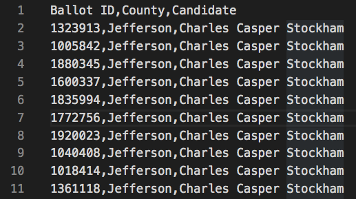
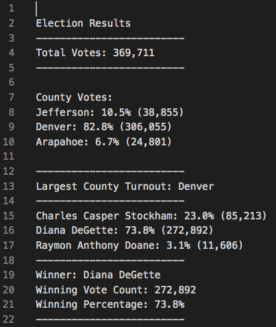

# **Election Analysis**  


## **Overview of Project**
in this project we are helping an employee of the Colorado board of elections to perform an election audit 


### **Purpose**
We have been provided with a tabular data file ([election_results.csv](Resources/election_results.csv)), containing the result of the election and our task is to go through this file, perform the analysis and report the following items in a text file:  

- The total number of the votes 

- results for counties:
    - Total number of votes in each county
    - The percentage of total votes for each county
    - The county with the largest number of votes 
- results for candidates:
    - Total number of votes each candidate received
    - The percentage of total votes for each candidate
- winning candidate:
    - candidate's name
    - number of votes the candidate received
    - the  percentage of total votes for this candidate


## **Results**  

### **Performing the Analysis**
As mentioned before, we have been provided with the data we need in a CSV file (comma-separated values). here is a part of the file:



As it is specified in the header each line of the data file contains voter's ballot ID, the name of the county and the candidate who received this vote

We used Python to write a code and get the result we need from this file. First we defined some of the variables needed to be initialized before going into the data file then we wrote the code to open the file and read:

```py
# Add our dependencies.
import csv
import os

# Add a variable to load a file from a path.
file_to_load = os.path.join("Resources/election_results.csv")
# Add a variable to save the file to a path.
file_to_save = os.path.join("analysis", "election_results.txt")

# Initialize a total vote counter.
total_votes = 0

# Candidate Options and candidate votes.
candidate_options = []
candidate_votes = {}

# Create a county list and county votes dictionary.
county_options=[]
county_votes={}


# Track the winning candidate, vote count and percentage
winning_candidate = ""
winning_count = 0
winning_percentage = 0

# Track the largest county and county voter turnout.
county_wlto=""
county_wlto_vcount=0


# Read the csv and convert it into a list of dictionaries
with open(file_to_load) as election_data:
    reader = csv.reader(election_data)
```
As you can see in the preview of the file the first line is the header and does not contane the informatio we want so to skip this line we added this part of the cod:
```py
    # Read the header
    header = next(reader)
``` 
Then we wrote the code to go through each line (row) of the file and collect the information we need. after skipping the header line, the total number of the votes would be the number of lines in the file, we created a counter variable to count the number of the lines therefore the total number of votes. As csv.reader() store the contents of each line of the file in a list we used a for loop to go through these lists. While passing each line we picked the name of each candidate and county adding them to the elements of two new lists (if they are not already there) and to the keys of new dictionaries (setting their initial values to zero in the dictionary). with adding 1 to the values in the dictionaries each time the conditional statement is not true we can have the total number of each county and candidate. Dividing these values by the total number of votes calculated before, percentage of total votes will be determined for counties and candidates

```py
# Read the csv and convert it into a list of dictionaries
with open(file_to_load) as election_data:
    reader = csv.reader(election_data)

    # Read the header
    header = next(reader)

    # For each row in the CSV file.
    for row in reader:

        # Add to the total vote count
        total_votes = total_votes + 1

        # Get the candidate name from each row.
        candidate_name = row[2]

        # Extract the county name from each row.
        county_name = row[1]

        # If the candidate does not match any existing candidate add it to
        # the candidate list
        if candidate_name not in candidate_options:

            # Add the candidate name to the candidate list.
            candidate_options.append(candidate_name)

            # And begin tracking that candidate's voter count.
            candidate_votes[candidate_name] = 0

        # Add a vote to that candidate's count
        candidate_votes[candidate_name] += 1

        # Write a decision statement that checks that the
        # county does not match any existing county in the county list.
        if county_name not in county_options:

            # Add the existing county to the list of counties.
            county_options.append(county_name)

            # Begin tracking the county's vote count.
            county_votes[county_name] = 0

        # Add a vote to that county's vote count.
        county_votes[county_name] += 1
```
After that we opened the TXT file we wanted to write the result of our analysis to and add the total number of votes to it:
```py
# Save the results to our text file.
with open(file_to_save, "w") as txt_file:

    # Print the final vote count (to terminal)
    election_results = (
        f"\nElection Results\n"
        f"-------------------------\n"
        f"Total Votes: {total_votes:,}\n"
        f"-------------------------\n\n"
        f"County Votes:\n")
    print(election_results, end="")

    txt_file.write(election_results)
```
We wrote the code below to calculate the percentage of total votes for each candidate and county and save it in the txt file

```py
    # Write a repetition statement to get the county from the county dictionary.
    for county_name in county_votes:
        # 6b: Retrieve the county vote count.
        votes_county = county_votes[county_name]
        # 6c: Calculate the percent of total votes for the county.
        county_vote_percentage = float(votes_county) / float(total_votes) * 100

        # 6d: Print the county results to the terminal.
        county_results = (f"{county_name}: {county_vote_percentage:.1f}% ({votes_county:,})\n")
        print(county_results)
        # 6e: Save the county votes to a text file.
        txt_file.write(county_results)
        # 6f: Write a decision statement to determine the winning county and get its vote count.
        if votes_county > county_wlto_vcount:
            county_wlto_vcount = votes_county
            county_wlto = county_name

    # Print the county with the largest turnout to the terminal.
    Largest_county_turnout=(
        f"\n-------------------------\n"
        f"Largest County Turnout: {county_wlto}\n"
        f"-------------------------\n")
    print(Largest_county_turnout)

    # Save the county with the largest turnout to a text file.
    txt_file.write(Largest_county_turnout)

    # Save the final candidate vote count to the text file.
    for candidate_name in candidate_votes:

        # Retrieve vote count and percentage
        votes = candidate_votes.get(candidate_name)
        vote_percentage = float(votes) / float(total_votes) * 100
        candidate_results = (
            f"{candidate_name}: {vote_percentage:.1f}% ({votes:,})\n")

        # Print each candidate's voter count and percentage to the
        # terminal.
        print(candidate_results)
        #  Save the candidate results to our text file.
        txt_file.write(candidate_results)
```
Finally, this is the part of the code which discovers the winning candidate and writ the results to our txt file 
```py
        # Determine winning vote count, winning percentage, and candidate.
        if (votes > winning_count) and (vote_percentage > winning_percentage):
            winning_count = votes
            winning_candidate = candidate_name
            winning_percentage = vote_percentage

    # Print the winning candidate (to terminal)
    winning_candidate_summary = (
        f"-------------------------\n"
        f"Winner: {winning_candidate}\n"
        f"Winning Vote Count: {winning_count:,}\n"
        f"Winning Percentage: {winning_percentage:.1f}%\n"
        f"-------------------------\n")
    print(winning_candidate_summary)

    # Save the winning candidate's name to the text file
    txt_file.write(winning_candidate_summary)
```

### **Conclusion**
After running the code this is how the output file ([election_results.txt](analysis/election_results.txt)) looks:



According to the results in the file (the image above):

- The total number of 369711 votes were cast in the election
- The number of votes for each county:
    - number of votes in Denver: 306055 which is 82.8% of total votes
    - number of votes in Jefferson: 38855 which is 10.5% of total votes
    - number of votes in Arapahoe: 24801 which is 6.7% of total votes
- Denver is the county with largest turnout
- the number of votes for each candidate:
    - Charles Casper Stockham: 85213 which is 23.0% of total votes
    - Diana DeGette: 272892 which is 73.8% of total votes
    - Raymon Anthony Doane: 11606 which is 3.1% of total votes
- Diana DeGette won the election with 272892 votes (73.8% of total votes)

## **summary**  

- The code we developed for this analysis can be used for any other district no matter how big the number of regions is in that district, there is no need to change anything in the code
- if it is a nationwide election and we need to get the result for each state too, this code can be changed easily to serve the purpose. this can be done by adding less than 20 lines of code, just one more conditional statement while passing through the lines of data in the source file and another loop to calculate and send the result to the output file like the one we had for candidates and counties in this code
